### Todo:

- Figure out how to sense for this error code 128.  on the condition if it occurs, then simply deploy.  Or, set some sort of setting of const overrideBadObj=True.  if(overrideBadObj=true) runDeploy().

[gha error msg](https://github.com/pmeaney/payloadcms-052225blue/actions/runs/15433628273/job/43435841904)
```
Q2: Does deployment marker artifact exist? Answer: true (Last commit: 2e752db)
fatal: bad object 2e752dbc7d1d436708dced49cb399384c85baf72
Error: Process completed with exit code 128.
```

---

# Template for Blue-Green Deployment of PayloadCMS

>A template ready to turn into a basic Dockerized, Github Actions CICD-deployed PayloadCMS project (e.g. blue-green)

This project serves as a foundation template - dubbed the "blue template" - designed to be used in a basic Dockerized blue/green deployment architecture.

The naming convention `payloadcms-052225blue` follows a structured pattern: replace the date stamp and color code with the date of your new instance creation. Each deployment instance should have its dedicated repository. For example, this template can be used to create a complete blue-green deployment with separate repositories: `payloadcms052225-blue` and `payloadcms052225-green`.

This template implements a Dockerized CICD deployment of PayloadCMS and PostgreSQL applications, plus a "remote-first, local sync" strategy for migrations and media synchronization. For detailed GitHub repository setup instructions enabling automated CICD deployment, consult the [`Deployment Configuration Guide`](./docs-and-extras/GUIDE--Deployment-Configuration.md).


## Project Components:

- **PayloadCMS Application Container**
  - Built via Dockerfile from the official PayloadCMS Template in the `./payloadcms-cms` directory, with strategic enhancements:
    - Optimized Dockerfile
    - Custom entrypoint script
    - Integrated "remote-first, local sync" process for media and migration files, ensuring your local development environment mirrors the production server
  - CICD pipeline automatically publishes your latest version as a containerized image to GitHub Container Registry
    - Plus a shell script to automate secrets upload to Github Repo Secrets, prior to the initial run of the CICD process

- **PostgreSQL Database Container**
  - Deployed directly from the official PostgreSQL image without modifications
  - The `./payloadcms-db` directory contains basic configuration
  - Set up directly on the server during deployment

Both components are deployed through a comprehensive CICD workflow consisting of three specialized files in `.github/workflows/` - for CMS, Database, and overall orchestration.

- **Migration Process**
  - This project follows a "Remote First, Local Sync" environment synchronization architecture.  What this means is... When we add new content, we add it on the Remote Server first, then we pull that content down to our local environment when we want to do development work-- such as adding a new content collection. Why? So that we'll do development work in a local app environment which perfectly mirrors the remote app.
    - When we want to do development work, it's important that we pull the newest version of the project from the remote server using the `sync-from-prod--FullStructure-andClean.sh` shell file.
  - The `sync-from-prod--FullStructure-andClean.sh` shell file will pull the database structure & content, as well as media files, from the remote server to the local server-- Thus, synchronizing the enviornments: the local will now mirror the remote.
  - From here, we're now ready to do some dev work.  **If that dev work is creating a new collection... then we will need to run through Payload's migration processes from the remote server.  Those steps are detailed in the [PayloadCMS-Collection-Migration-Guide.md](./docs-and-extras/PayloadCMS/PayloadCMS-Collection-Migration-Guide.md)**.

**Important:** This project creates dedicated bind mount directories for media and migration files. These are created in the CICD user's home directory at:
  - `/home/ghaCICDDevOpsUser/payloadcms-cms-052225blue__migrations`
  - `/home/ghaCICDDevOpsUser/payloadcms-cms-052225blue__media`


That is to say-- since it's the Github Action's CICD Ssh User which deploys the app to `/home/<your CICD user>` (e.g., `/home/ghaCICDDevOpsUser`)... the location of the migrations & media bind mount directory will be in that particular user's home dir (not your human user's-- so when you log in a as a human you'll need to navigate to `/home/ghaCICDDevOpsUser` to see the migration & media files sitting on the server). The included sync script `sync-from-prod--FullStructure-andClean.sh` retrieves these files to configure your local environment to closely match the remote server, streamlining development.

# Custom Next.js Dockerfile & Entrypoint.sh Setup for PayloadCMS

This project includes enhanced Docker configuration tailored specifically for PayloadCMS deployment. The improvements are focused on practical solutions to common deployment challenges.

## Dockerfile Improvements

The standard Next.js Dockerfile has been customized with several practical improvements:

- **PNPM Optimization**: Switched to PNPM exclusively for faster, more reliable dependency management
- **Flexible Build Process**: Added an option to skip Next.js build during image creation
  - Useful when database connectivity is required during build but not available in CI/CD
  - Allows the build to happen after container deployment when database is accessible
- **Database Support**: Added PostgreSQL client to enable connectivity checks
- **Environment Variable Handling**: Better management of environment variables between build stages
- **File Organization**: Improved structure for migrations and runtime files

The modified Dockerfile introduces a multi-stage build process with a dedicated preparation stage that organizes files differently based on the selected build mode. This approach significantly improves deployment flexibility by allowing builds to be completed either during image creation or after deployment when a database connection is available. It also ensures proper file permissions and directory structures are in place, which is critical for PayloadCMS operations, especially when dealing with database migrations and content storage.

## Custom Entrypoint Script

The original Docker setup used a simple start command. We've added an entrypoint script that:

- Checks for required environment variables before starting
- Waits for PostgreSQL database to become available
- Creates and manages database migration directories
- Intelligently detects and applies new migrations
- Handles build completion if deferred from the Dockerfile
- Provides helpful status messages during startup

The entryscript specifically addresses challenges with Next.js builds in the PayloadCMS context by setting the environment variable NEXT_SKIP_DB_CONNECT=true during the build process. This is a crucial workaround because when building the Docker image during CI/CD, the PostgreSQL database doesn't yet exist, but Next.js and PayloadCMS would normally try to connect to it during build time. By setting this flag, the build process effectively bypasses database connectivity requirements, allowing the image to be constructed successfully without an active database connection. This "mock" approach prevents build failures while still ensuring the application will properly connect to the database when actually deployed and running.

## Why These Changes Matter

These modifications solve real-world challenges when deploying PayloadCMS:

1. **Database Dependency**: PayloadCMS often needs database access during build, which isn't available in CI/CD
2. **Migration Management**: Proper handling of database migrations during container startup
3. **Improved Reliability**: Better error handling and state checking

The result is a more robust deployment process that works well in CI/CD environments while maintaining proper database connectivity and migration management.

## Usage

The enhanced Docker setup works seamlessly with the included GitHub Actions workflows, allowing for both:

- Complete builds during image creation (when database isn't needed)
- Deferred builds that complete after deployment (when database access is required)

This flexibility makes the deployment process more reliable across different environments.

## Deployment Options:

### Remote Docker Deployment
The CICD files automatically handle remote Docker deployment once you configure the A. Repo, B. Repo Secrets, and C. the various templated placeholder names, as detailed in the [`Deployment Ce`](./docs-and-extras/GUIDE--Deployment-Configuration.md).

You'll want to clone the project, follow my terraform deployment guide, then follow the Deployment Configuration Guide.

### Local Docker Development

1. Clone the project
2. Launch the local development environment with this command.  It spins up in the background, then tails the logs.
```bash
docker compose -f docker-compose.local.yml up -d && docker compose -f docker-compose.local.yml logs -f
```

### Helpful commands

- Connect to postgresql, once sshed into server (uses default credentials):
  - `docker exec -it payloadcms-db-052225blue psql -U payloadcms-052225blue-user -d payloadcms-db-052225blue`

### Remote Deployment

For Remote Deployment, see

### Local Docker After Remote Development

This project follows a **Remote First, Local Sync** strategy.

Which means... to develop a project on the template, you'll need to reploy it to a remote server (1cvpu, 2gb ram minimum).  From there, you can run the `./payloadcms-cms/sync-from-prod.sh` script, which will pull the migration & media directories from the live remote server... down to your local laptop.  From there, you can run the Local Docker Development command `docker compose -f docker-compose.local.yml up -d && docker compose -f docker-compose.local.yml logs -f` and your local environment at `localhost:3000` on your browser should mimic what you see at your live webiste.  It populates your local project with the same setup (database schema & data, and media files) that the project has on your remote server.


## Resources

- Original Repo, where I figured out a deployment methodology: 
  - [template-payloadcms-portfolio2025](https://github.com/pmeaney/template-payloadcms-portfolio2025)
- [PayloadCMS's Website Template](https://github.com/payloadcms/payload/tree/main/templates/website)

## CICD Workflow

```mermaid
flowchart TB
    GitPush[/"Push to main branch"/] --> MainWorkflow["z-main.yml
    Main Deployment Pipeline"]
    
    MainWorkflow --> DBCheckInit
    
    subgraph "Database Pipeline"
        DBCheckInit["a-db-init.yml
        Database Check & Init"]
        DBCheckInit --> CheckDBExists{"DB Container
        Exists?"}
        CheckDBExists -->|No| CreateDB["Create PostgreSQL Container
        - Create volumes
        - Configure networks
        - Set environment vars"]
        CheckDBExists -->|Yes| SkipDB["Skip Database Setup"]
    end
    
    CreateDB --> CMSFECheck
    SkipDB --> CMSFECheck
    
    subgraph "Frontend Pipeline"
        CMSFECheck["b-cms-fe-check-deploy.yml
        Frontend Check & Deploy"]
        CMSFECheck --> DownloadMarker["Download Last
        Deployment Marker"]
        DownloadMarker --> DetectChanges["Check PayloadCMS
        Directory Changes"]
        DetectChanges --> ChangesExist{"Changes
        Detected?"}
        
        ChangesExist -->|Yes| BuildPublish["Build & Publish
        Docker Image"]
        BuildPublish --> DeployFE["SSH to Server &
        Deploy Frontend
        (step-deploy--cms-fe)"]
        DeployFE --> SaveMarker["Save Deployment
        Marker Artifact"]
        
        ChangesExist -->|No| SkipFE["Skip Frontend
        Deployment"]
    end
    
    subgraph "Docker Build Process"
        BuildPublish --> DockerBuildStages["Multi-stage Dockerfile"]
        
        subgraph "Build Stages"
            subgraph "Base & Dependencies Setup"
                DockerBuildStages --> BaseImage["Base Stage
                - node:20-alpine
                - Install pnpm@10.3.0"]
                BaseImage --> DepsStage["Dependencies Stage
                - Add libc6-compat
                - Copy package.json & lock file
                - pnpm install --frozen-lockfile"]
                DepsStage --> BuilderStage["Builder Stage
                - Copy dependencies from Dependencies Stage
                - Copy all source files
                - Copy ENV_FILE to .env
                - Set SKIP_NEXTJS_BUILD flag"]
            end
            
            subgraph "Build Decision & Execution"
                BuilderStage --> SkipNextBuild{"SKIP_NEXTJS_BUILD
                = true?"}
                SkipNextBuild -->|Yes| PrepareRuntime["Prepare for Runtime Build
                - Create minimal .next
                - Set skip-build flag
                - Copy src, config files"]
                SkipNextBuild -->|No| RunBuild["Run Full Build
                - pnpm run ci
                - Build Next.js app"]
            end
            
            subgraph "Runtime Preparation"
                PrepareRuntime --> RuntimePrep["prepare-runtime Stage
                - Copy env vars, public files
                - Copy config files
                - Copy entrypoint.sh
                - Copy src/migrations"]
                RunBuild --> RuntimePrep
                
                RuntimePrep --> RuntimeBuildCheck{"SKIP_NEXTJS_BUILD
                = true?"}
                RuntimeBuildCheck -->|Yes| CopySourceFiles["Copy entire src dir
                for runtime build"]
                RuntimeBuildCheck -->|No| CopyBuildOutput["Copy built .next
                artifacts"]
                
                CopySourceFiles --> RunnerStage
                CopyBuildOutput --> RunnerStage
            end
            
            subgraph "Final Image"
                RunnerStage["Runner Stage
                - Set NODE_ENV=production
                - Install postgresql-client
                - Add nextjs user/group
                - Copy prepared files
                - Set file permissions
                - Expose port 3000"]
                RunnerStage --> FinalDockerImage[/"Docker Image
                ghcr.io/pmeaney/portfolio-payloadcms:latest"/]
            end
        end
    end
    
    subgraph "Deployment Process"
        DeployFE --> SSHToServer["SSH to Production Server"]
        SSHToServer --> AuthGHCR["Authenticate with
        Container Registry"]
        AuthGHCR --> CreateEnvFile["Create Prod Env File
        from PAYLOAD__SECRET_ENV_FILE"]
        CreateEnvFile --> PullImage["docker pull
        ghcr.io/pmeaney/portfolio-payloadcms:latest"]
        PullImage --> RemoveOldContainer["docker rm -f
        payloadcms-cms-portfolio-prod"]
        RemoveOldContainer --> RunContainer["docker run
        - Set container name
        - Connect to postgres network
        - Connect to main network
        - Map port 3000
        - Inject env vars"]
        
        FinalDockerImage -.-> PullImage
    end
    
    subgraph "Container Runtime"
        RunContainer --> EntrypointScript["entrypoint.sh Execution"]
        
        EntrypointScript --> EnvCheck["Environment Checks
        - Verify DATABASE_URI
        - Verify PAYLOAD_SECRET"]
        EnvCheck --> ParseDBParams["Parse Database
        Connection Parameters
        from DATABASE_URI"]
        ParseDBParams --> WaitForDB["Wait for PostgreSQL
        (30 attempts with 3s delay)
        using pg_isready"]
        
        WaitForDB --> RunMigrations["Run Database Migrations
        pnpm run payload:migrate"]
        RunMigrations --> CheckSkipBuildFlag{".next/skip-build
        file exists?"}
        
        CheckSkipBuildFlag -->|Yes| BuildNextJS["Build Next.js
        NEXT_SKIP_DB_CONNECT=true
        pnpm run build"]
        CheckSkipBuildFlag -->|No| StartApp["Start Next.js Application
        pnpm run start"]
        BuildNextJS --> StartApp
    end
    
    subgraph "Verification & Summary"
        DeployFE --> WaitPeriod["Wait Period (4 min)"]
        WaitPeriod --> CheckContainers["docker ps -a"]
        CheckContainers --> CheckLogs["docker logs
        <containerId>"]
        
        SkipDB --> DeploySummary["Generate Deployment
        Summary"]
        CreateDB --> DeploySummary
        SkipFE --> DeploySummary
        SaveMarker --> DeploySummary
        DeploySummary --> MarkdownReport["Create Markdown Report
        - Commit details
        - Database status
        - Frontend changes
        - Action taken"]
    end
    
    classDef workflow fill:#f9f,stroke:#333,stroke-width:2px
    classDef process fill:#bbf,stroke:#333,stroke-width:1px
    classDef decision fill:#fbb,stroke:#333,stroke-width:1px
    classDef container fill:#bfb,stroke:#333,stroke-width:1px
    classDef dockerstage fill:#9de,stroke:#333,stroke-width:1px
    classDef entrypoint fill:#bfd,stroke:#333,stroke-width:1px
    
    class MainWorkflow,DBCheckInit,CMSFECheck workflow
    class DetectChanges,BuildPublish,DeployFE,RunContainer process
    class CheckDBExists,ChangesExist,CheckSkipBuildFlag,SkipNextBuild,RuntimeBuildCheck decision
    class StartApp container
    class BaseImage,DepsStage,BuilderStage,PrepareRuntime,RunBuild,RuntimePrep,RunnerStage,CopySourceFiles,CopyBuildOutput dockerstage
    class EntrypointScript,EnvCheck,ParseDBParams,WaitForDB,RunMigrations,BuildNextJS entrypoint
```


