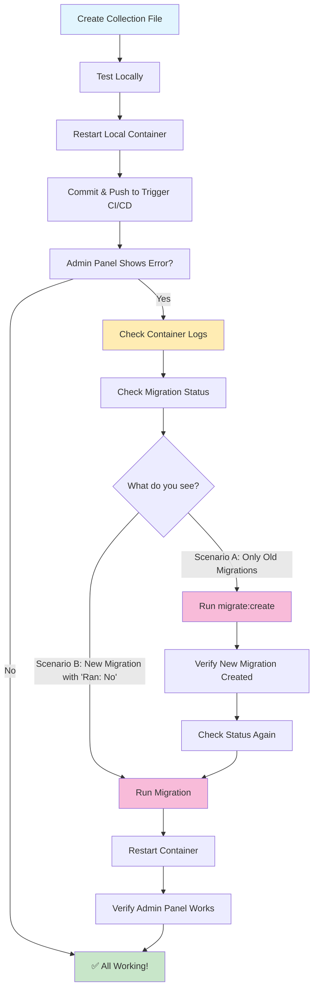

# PayloadCMS Collection Migration Guide

## Overview
When you add a new collection to PayloadCMS, the database schema needs to be updated to match. This guide covers the complete process from local development to production deployment.

## Step 1: Create the Collection File

Create your collection file (e.g., `src/collections/CaseStudies.ts`):

```typescript
import type { CollectionConfig } from 'payload'

export const CaseStudies: CollectionConfig = {
  slug: 'case-studies',
  // ... your collection configuration
}
```

**Important Note:** This only provides admin interface access to create content. The content will be available via REST API, but you won't have publicly viewable pages until you build frontend components (list page & detail page).

## Step 2: Test Locally

After creating your collection:
1. Restart your local container to pick up the new collection
2. Visit `/admin` locally to verify the collection appears
3. Test creating sample content

## Step 3: Deploy to Production

1. **Commit and push** your changes to trigger CI/CD deployment
2. **Wait for deployment** to complete

## Step 4: Handle Production Database Migration on Remote Server

After deployment, the live site's admin panel at `yourSite.com/admin` will likely show an error because the database schema hasn't been updated yet.

### Troubleshooting Steps

**1. Check container logs** for database errors like:
```
error: column payload_locked_documents__rels.case_studies_id does not exist
```

**2. Check existing migration files:**
```bash
docker exec -it [container-name] ls -la /app/src/migrations
```
Look for recent migration files. If you only see old dates, you need to create a new migration.

**3. Check migration status:**
```bash
docker exec -it [container-name] pnpm payload:migrate:status
```

You'll see one of two scenarios:

**Scenario A: Only old migrations exist (most common case)**
```
┌─────────────────┬───────┬─────┐
│            Name │ Batch │ Ran │
├─────────────────┼───────┼─────┤
│ 20250523_184732 │     1 │ Yes │
└─────────────────┴───────┴─────┘
```
If you only see migrations with old dates (e.g., May 23rd when today is May 28th), this means no migration has been created for your new collection yet because the `migrate:create` command hasn't been run. **Continue to Step 4**.

**Scenario B: New migration exists but hasn't run yet**
```
┌─────────────────┬───────┬─────┐
│            Name │ Batch │ Ran │
├─────────────────┼───────┼─────┤
│ 20250523_184732 │     1 │ Yes │
│ 20250528_203707 │       │  No │
└─────────────────┴───────┴─────┘
```
If you see a migration with "No" in the "Ran" column, you've already run `migrate:create` so you just need to run the migration. **Skip to Step 6**.

**4. Create new migration (if needed):**
```bash
docker exec -it [container-name] pnpm payload:migrate:create
```

This compares your current schema with the database and generates the necessary changes.

**5. Verify new migration was created:**
```bash
docker exec -it [container-name] pnpm payload:migrate:status
```

**6. Run the migration:**
```bash
docker exec -it [container-name] pnpm payload:migrate --force-accept-warning
```

**7. Restart the container:**
```bash
docker restart [container-name]
```

This step is crucial because:
- Clears all cached schema information
- Rebuilds the Payload configuration with updated database schema  
- Regenerates the admin UI with correct field mappings

## Why Container Restart is Necessary

In containerized applications, the app loads its schema configuration at startup. Even after updating the database, the running application still has the old schema cached in memory. Restarting ensures the app picks up the new database structure.

## Verification

After completing all steps:
1. Visit `/admin` - should load without errors
2. Navigate to your new collection
3. Create/edit content to verify everything works

## Command Reference

```bash
# Check migration files
docker exec -it [container-name] ls -la /app/src/migrations

# Check migration status  
docker exec -it [container-name] pnpm payload:migrate:status

# Create new migration
docker exec -it [container-name] pnpm payload:migrate:create

# Run migrations
docker exec -it [container-name] pnpm payload:migrate --force-accept-warning

# Restart container
docker restart [container-name]
```

## Common Issues

- **"Column does not exist" errors** = Missing migration
- **Admin panel won't load** = Need to restart container after migration
- **Changes not showing** = Migration created but not run yet

**Server stdout errors**:

- `"You are not allowed to perform this action"`
  - You added a new collection, migrated it to the server.  It appears in the admin. But when you visit its public component page, you see this stdout error on the server: "You are not allowed to perform this action".  Try adding this csrf array, containing of URLs of your site root URL(s) to payload.config.ts:
  ```typescript
  export default buildConfig({
  // this csrf setting is apparently important-- without it, if you add a new collection,
  // you may face an error of "You are not allowed to perform this action"
  csrf: [
    'https://www.yourSite.com',
    'https://yourSite.com',
    // include other subdomains of your site as well
  ],
  ```


## Process Flow Diagram

This process ensures your production database schema stays in sync with your PayloadCMS collection definitions.

